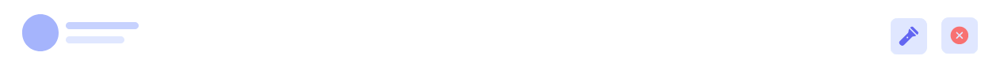
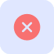

# Navbar

!> `src/components/Navbar.js`

?> Navbar and its child component's `devOptionsContext` usage explaination can be found in DevOptions Context secton.

## Laser Control

!> `src/components/LaserButton.js`

<!-- prettier-ignore -->
|Hook|Name|Type|Description|
|----|----|----|-----------|
|useContext|sendMessage|function|Acquires `sendMessage` callback from global state and later on uses it to send on/off messages to the laserpro.|

This button allows turning the laser on and off, granted its connected successfully.

?> This button is deliberately not a toggle switch because the laser oftens _misses_ signals, which will break UX if the laser remains on even though the switch is in off position. One attempt at ensuring status replication has been for the laser to return a confirmation message for every on/off signal, however that mechanism is not robust since laser sometimes sends incorrect confirmation message.

## Connection Status

!> `src/components/Navbar.js` Variable component in `Navbar.js`.

<!-- prettier-ignore -->
|Hook|Name|Type|Description|
|----|----|----|-----------|
|useContext|connect|function|`connect` callback from devOptionsContext to establish connection when this button is clicked.|

!> **Refactor**: separate component to dedicated file

This _button_ works as:

-   connection status indicator with three possible states-
    1. **Disconnected**, a red cross.
    2. **Connecting**, a yellow spinner.
    3. **Connected**, a green checkmark.
-   connection refresher. Regardless of whatever the state may be, if this button is clicked the dashboard drops current connection and attempts to establish a new one.

!> "Connection" refers to the local/non-internet `WebSocket` connection between the dashboard, and the laserPro.

## Mode Button

!> `src/components/ModeButton.js`

| Hook     | Name       | Type   | Description                                                              |
| -------- | ---------- | ------ | ------------------------------------------------------------------------ |
| useState | selectMode | object | Used as data source for button list population and entry customizations. |

_Will_ control programming modes:

1. block based: Blockly.
2. code: Code editor, most likely python.
3. drawing mode: free hand mode that lets users draw using _ms paint_ like tools.

?> As of writing this doc, the button was removed for _Ector County Summercamp_ since it served no functional purpose.

!> **Refactor**: `ModeButton` needs to be refactored to use `DropDown`.

