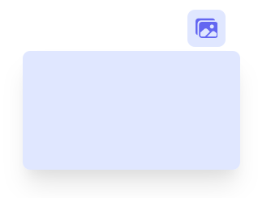

# Reusable Components

While some components are separated for readability and logic separation, these components that have been abstracted enough to be entirely reusable and _customizable_.

## Container

!> `src/components/container.js`

A very basic component with white background, and theme based border radius. Its used as background for each of the separate sections.

| Prop        | Type      | Description                           |
| ----------- | --------- | ------------------------------------- |
| `children`  | component | Container content.                    |
| `className` | string    | Any additional classes to be applied. |

## DropDown

!> `src/components/DropDown.js`

A dropdown/popover based on [headless UI popover](https://headlessui.dev/react/popover) used throughout the app for multiple buttons.

| Prop        | Type      | Description                                                            |
| ----------- | --------- | ---------------------------------------------------------------------- |
| `primary`   | boolean   | If true, dropdown is primary colored.                                  |
| `button`    | component | Button that toggles the dropdown.                                      |
| `title`     | string    | **Optional**. If passed, this text is added as dropdown content title. |
| `className` | string    | Classes to be applied to the dropdown content.                         |
| `children`  | component | Dropdown Content                                                       |

## Title

!> `src/components/Title.js`

Text component with all the required styles, used as title for sectons.

| Prop        | Type      | Description                                   |
| ----------- | --------- | --------------------------------------------- |
| `children`  | component | Text to be shown as title is passed as child. |
| `className` | string    | Classes to be applied to the text.            |

## Toggle

!> `src/components/Toggle.js`

Toggle switch.

| Prop     | Type     | Description                          |
| -------- | -------- | ------------------------------------ |
| `text`   | string   | Text to be shown next to switch.     |
| `switch` | boolean  | default switch state                 |
| `setOn`  | function | callback for when switch is toggled. |
